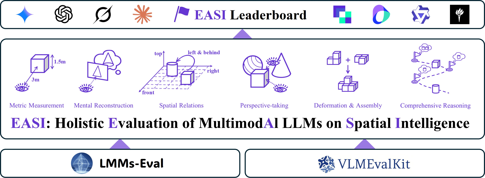

<div align="center">
  

  <b>EASI: Holistic Evaluation of Multimodal LLMs on Spatial Intelligence</b>

  [English](README.md) | 简体中文

</div>

<p align="center">
    <a href="https://arxiv.org/abs/2508.13142" target="_blank">
        
    </a>
    <a href="https://huggingface.co/spaces/lmms-lab-si/EASI-Leaderboard" target="_blank">
        
    </a>
    <a href="https://github.com/EvolvingLMMs-Lab/EASI/blob/main/LICENSE"></a>
</p>

## 快速了解（TL;DR）

- EASI 是一个面向多模态大模型空间智能（Spatial Intelligence）的统一评测套件。
- EASI 支持**两种评测后端**：[VLMEvalKit](https://github.com/open-compass/VLMEvalKit) 和 [lmms-eval](https://github.com/EvolvingLMMs-Lab/lmms-eval)。
- 完成安装后，可以用下面的命令快速跑一个示例：

**使用 EASI (VLMEvalkit 后端)：**
```bash
cd VLMEvalKit/
python run.py --data MindCubeBench_tiny_raw_qa \
              --model SenseNova-SI-1.3-InternVL3-8B \
              --verbose --reuse --judge extract_matching
```

**使用 EASI (LMMs-Eval 后端)：**
```bash
lmms-eval --model qwen2_5_vl \
          --model_args pretrained=sensenova/SenseNova-SI-1.1-Qwen2.5-VL-3B \
          --tasks site_bench_image \
          --batch_size 1 \
          --log_samples \
          --output_path ./logs/
```

## 概述

EASI 是一个面向空间智能的统一评测套件，用于在不断扩展的空间基准上评估最先进的闭源和开源多模态大模型。

- **广泛支持**：目前 EASI([v0.2.0](https://github.com/EvolvingLMMs-Lab/EASI/releases/tag/0.2.0))支持 **23 个空间智能模型**和 **25 个空间基准测试**。
- **双后端支持**：
  - **VLMEvalKit**：丰富的模型库，内置评判功能。
  - **lmms-eval**：轻量级、基于 accelerate 的分布式评测，支持大量任务。

更多详情请参阅 👉 **[Supported Models & Benchmarks](docs/Support_bench_models.md)**。EASI 同时提供透明的 👉 **[Benchmark Verification](docs/Benchmark_Verification.md)** 以供与官方分数对比。

## 🗓️ 最新动态

🌟 **[2026-01-16]** [EASI v0.2.0](https://github.com/EvolvingLMMs-Lab/EASI/releases/tag/0.2.0) 发布。主要更新包括：
- **新增后端支持**：集成了 lmms-eval 与 VLMEvalKit，提供灵活的评测选择。
- **基准支持扩展**：新增 DSR-Bench。

完整发版历史和详细更新日志，请参见 👉 **[Changelog](docs/CHANGELOG.md)**。

## 🛠️ 快速上手
### 安装

EASI 提供两种评测后端，您可以根据需要安装其中一个或两个。

#### 方式一：本地环境（VLMEvalKit 后端）

```bash
git clone --recursive https://github.com/EvolvingLMMs-Lab/EASI.git
cd EASI
pip install -e ./VLMEvalKit
```

#### 方式二：本地环境（lmms-eval 后端）

```bash
git clone --recursive https://github.com/EvolvingLMMs-Lab/EASI.git
cd EASI
pip install -e ./lmms-eval spacy
# 推荐依赖
# 在 pyproject.toml 中使用 "torch==2.7.1", "torchvision==0.22.1"（适用于大多数模型）
# 安装 flash-attn 以加速推理
pip install flash-attn --no-build-isolation
```

#### 方式三：基于Docker

```bash
bash dockerfiles/EASI/build_runtime_docker.sh

docker run --gpus all -it --rm \
  -v /path/to/your/data:/mnt/data \
  --name easi-runtime \
  vlmevalkit_EASI:latest \
  /bin/bash
```

### 评测

EASI 支持两种评测后端，请根据您的需求选择合适的后端。

---

#### 后端 1：VLMEvalKit

**通用命令**
```bash
python run.py --data {BENCHMARK_NAME} --model {MODEL_NAME} --judge {JUDGE_MODE} --verbose --reuse
```
请参阅下方的"配置"部分，查看所有可用模型和基准测试的完整列表。请参阅 `run.py` 文件，查看所有参数的完整列表。

**示例**

在 `MindCubeBench_tiny_raw_qa` 上评测 `SenseNova-SI-1.3-InternVL3-8B`：

```bash
python run.py --data MindCubeBench_tiny_raw_qa \
              --model SenseNova-SI-1.3-InternVL3-8B \
              --verbose --reuse --judge extract_matching
```
这将使用正则表达式来提取答案。如果您想使用基于 LLM 的评判系统（例如，在评估 SpatialVizBench_CoT 时），您可以将评判系统切换到 OpenAI：
```bash
export OPENAI_API_KEY=YOUR_KEY
python run.py --data SpatialVizBench_CoT \
              --model {MODEL_NAME} \
              --verbose --reuse --judge gpt-4o-1120
```

---

#### 后端 2：lmms-eval

lmms-eval 提供基于 accelerate 的分布式评测，支持多 GPU 推理。

**通用命令**
```bash
lmms-eval --model {MODEL_TYPE} \
          --model_args pretrained={MODEL_PATH} \
          --tasks {TASK_NAME} \
          --batch_size 1 \
          --log_samples \
          --output_path ./logs/
```

**示例：单 GPU**

在 `site_bench_image` 上评测 `Qwen2.5-VL-3B-Instruct`：

```bash
lmms-eval --model qwen2_5_vl \
          --model_args pretrained=Qwen/Qwen2.5-VL-3B-Instruct \
          --tasks site_bench_image \
          --batch_size 1 \
          --log_samples \
          --output_path ./logs/
```

**示例：多 GPU（使用 accelerate）**

```bash
CUDA_VISIBLE_DEVICES=0,1,2,3 accelerate launch \
    --num_processes=4 \
    --num_machines=1 \
    --mixed_precision=no \
    --dynamo_backend=no \
    --main_process_port=12346 \
    -m lmms_eval \
    --model qwen2_5_vl \
    --model_args pretrained=Qwen/Qwen2.5-VL-3B-Instruct,attn_implementation=flash_attention_2 \
    --tasks site_bench_image \
    --batch_size 1 \
    --log_samples \
    --output_path ./logs/
```

**列出所有可用任务**
```bash
lmms-eval --tasks list
```

更多 lmms-eval 使用详情，请参阅 [lmms-eval/docs/](lmms-eval/docs/) 中的文档，包括 [模型指南](lmms-eval/docs/model_guide.md)、[任务指南](lmms-eval/docs/task_guide.md) 和 [运行示例](lmms-eval/docs/run_examples.md)。

---

### 配置

**EASI (后端=VLMEvalKit)**
- **模型**：定义在 `vlmeval/config.py` 中。请使用 `vlmutil check {MODEL_NAME}` 验证推理是否可用。
- **基准**：完整支持列表请见 [VLMEvalKit Supported Benchmarks](https://aicarrier.feishu.cn/wiki/Qp7wwSzQ9iK1Y6kNUJVcr6zTnPe?table=tblsdEpLieDoCxtb&view=vewa8sGZrY)。
- **EASI 特有**：针对 [EASI Leaderboard](https://huggingface.co/spaces/lmms-lab-si/easi-leaderboard)，相关基准测试汇总于 [支持的模型与基准](docs/Support_bench_models.md)。

**EASI (后端=lmms-eval)**
- **模型**：lmms-eval 支持多种模型类型（如 `qwen2_5_vl`, `llava`, `internvl2` 等）。使用 `--model_args` 指定模型参数（如 `pretrained`, `attn_implementation` 等）。
- **任务**：任务定义在 `lmms-eval/lmms_eval/tasks/`。列出所有可用任务：
  ```bash
  lmms-eval --tasks list
  ```

  空间智能评测的示例任务：
  | 任务名称 | 描述 |
  |-----------|-------------|
  | `site_bench_image` | SITE-Bench 图像评测 |
  | `site_bench_video` | SITE-Bench 视频评测 |

  更多 lmms-eval 使用详情，请参阅 [lmms-eval 文档](lmms-eval/README.md)。

### 提交

将您的评测结果提交到我们的 [EASI Leaderboard](https://huggingface.co/spaces/lmms-lab-si/easi-leaderboard)：

1. 访问 [EASI Leaderboard](https://huggingface.co/spaces/lmms-lab-si/easi-leaderboard) 页面。
2. 点击 **🚀 Submit here!** 进入提交表单。
3. 按照页面上的说明填写提交表单，并提交你的结果。

## 🖊️ 引用

```bib
@article{easi2025,
  title={Holistic Evaluation of Multimodal LLMs on Spatial Intelligence},
  author={Cai, Zhongang and Wang, Yubo and Sun, Qingping and Wang, Ruisi and Gu, Chenyang and Yin, Wanqi and Lin, Zhiqian and Yang, Zhitao and Wei, Chen and Shi, Xuanke and Deng, Kewang and Han, Xiaoyang and Chen, Zukai and Li, Jiaqi and Fan, Xiangyu and Deng, Hanming and Lu, Lewei and Li, Bo and Liu, Ziwei and Wang, Quan and Lin, Dahua and Yang, Lei},
  journal={arXiv preprint arXiv:2508.13142},
  year={2025}
}
```
